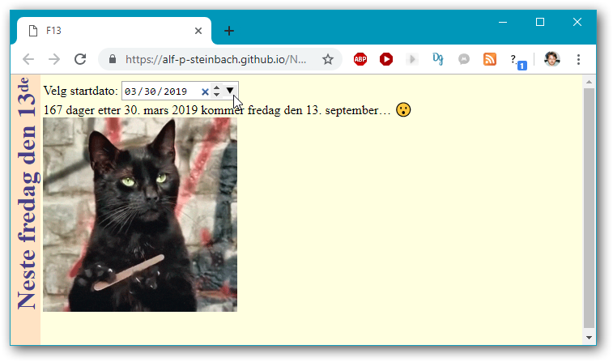
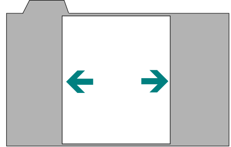
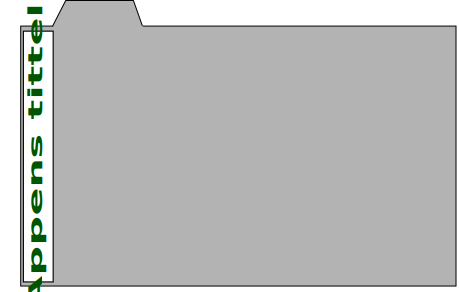

# Kodeprat: «f13» i Javascript og i C++.

«f13» er en nær minimal applikasjon som finner neste fredag den 13. (default), eller neste fredag den 13. etter en angitt dato.

Jeg laget f13 som web-app i HTML+CSS+Javascript, og som konsollprogram i ren C++.

I  Robert M. Pirsigs klassiske [*Zen and the Art of Motorcycle Maintenance*](https://en.wikipedia.org/wiki/Zen_and_the_Art_of_Motorcycle_Maintenance), verd å ha lest for alle utviklere og ingeniører, forteller hovedpersonen Phaedrus (jeg ble kalt Petrus som barn), en mann med sans for kvalitet (det mener jeg også å være), om hvordan han ledet en studine med skrivevegring mot å finne noe stadig mindre og enklere å fokusere på (og ja, jeg har også vært lærer). I utgangspunktet skulle hun skrive om en hel by, som hun ikke klarte å finne noe fornuftig å si om, men til slutt, etter en serie innskrenkinger, fikk Phaedrus fokusert henne ned til kun én spesifikk murstein i fasaden til et bygg der. *Da* løste deg seg, nærmest en forløsning, og hun fant ~uendelig mye å skrive om denne spesifikke mursteinen.

Og det er konseptet her, en minste lille ting å skrive om.

Web-appen var desidert enklest å lage,  og hvem som helst kan bruke den bare de får [en link](https://alf-p-steinbach.github.io/Neste-fredag-den-trettende/) å klikke. Den tar seg også best ut. Men den har noen små skjønnhetsfeil, inkludert funksjonalitetsfeil, nemlig en mulig engelsk presentasjon av dato i input-feltet:

Det ser ut til at småfeilene ville ha krevd uforholdsmessig stor innsats å ordne, men å måtte akseptere dem er et rimelig kompromiss.

For konsollprogrammet ble koden adskillig mer komplisert fordi C++ standardbiblioteket mangler fullverdig datohåndtering. Der er ingen datoklasse, kun funksjonene fra C sitt standardbibliotek. Og som et eksempel gir ikke den håndteringen portabel støtte for datoer før 1970&hellip;

C++ er basert på frihet til å velge de tredjeparts bibliotekene man vil ha, eller eventuelt ***å lage*** funksjonaliteten fra grunnen av, heller enn å bli påtvunget standardløsninger. Altså omtrent det motsatte av Java og Python: i C++ er det «no batteries included», lag dem selv. Og jeg ønsket å lage dette f13-eksemplet uten andre tredjeparts biblioteker enn grunnleggende notasjonsstøtte fra mitt eget *cppx-core*, for å sammenligne C++koden med web-appen.

## Analyse.

Før jeg startet å kode appen tenkte jeg over om det garantert finnes en fredag den 13. hvert år. Det har betydning for om man greit alltid kan unnlate å oppgi årstallet for den neste forekomsten, eller om det noen ganger må eksplisitt med. Jeg tenkte bare røfft og kjapt gjennom tingene, kanskje et minutt eller så. Nemlig, siden der er 12 13-datoer i året, og siden omtrent hver sjuende 13-dato vil være en fredag, er det rimelig å forvente minst én og ofte to fredag den 13. i et år. Det var nok for meg.

En mer pedantisk formell analyse kan være:

hvis det er slik at progresjonen av dager per måned sørger for at alle ukedager blir brukt minst én gang som 1. (eller 13.) i måneden, så har man garantert en fredag den 13. et sted.

~~~cpp
#include <cppx-core/_all_.hpp>
auto main() -> int
{
    $use_cppx( enumerated );
    $use_std( cout, endl );

    int days_per_month[] = {31, 0, 31, 30, 31, 30, 31, 31, 30, 31, 30, 31};
    for( const auto the: enumerated( {"normalår", "skuddår"} ) )
    {
        days_per_month[1] = 28 + the.index;
        int weekday_hits[7] = {};
        int day_number = 0;
        for( const int days: days_per_month )
        {
            day_number += days;
            ++weekday_hits[day_number % 7];
        }
        for( const int n_hits: weekday_hits ) { cout << n_hits << " "; }
        cout << "(" << the.item << ")" << endl;
    }
}
~~~

Resultat – alle ukedager blir truffet av den 1. i en måned:

~~~txt
1 2 1 3 1 2 2 (normalår)
2 1 2 2 2 1 2 (skuddår)
~~~

Dette er moderne post-C++11 *trailing return type* og *range based for-loop* syntaks C++, supplert med et lite (ennå ikke publisert! ikke alltid helt konsistent! under utvikling!) støttebibliotek kalt [*cppx-core*](https://github.com/alf-p-steinbach/cppx-core).

Bekvemmelighets­makroene `$use_cppx` og `$use_std` kommer fra dette støtte­biblioteket, noe à la at man i Javascript gjerne bruker `$`-funksjonen fra for eksempel jQuery-biblioteket. Jeg har brukt ikke-formelt-tillatt `$` for å unngå ropende og kaukende versalnavn, og det støttes så vidt jeg vet av alle de vanlig brukte C++-kompilatorene. Makroene kan likevel om ønskelig uttrykkes, bare mindre pent for mine øyne, uten  `$` (eksempel: `CPPX_USE_STD`).

Det er 427 dager fra fredag den 13. juli 2018 til neste fredag den 13. i september 2019, som viser at det kan være mer enn et år mellom to påfølgende fredag den 13. Men at det er minst én fredag den 13. i hvert år betyr at distansen maksimalt er rundt to år. Med dagens maskiner er et enkelt *brute force* søk gjennom noen hundre dager, selv med kalender­logikk involvert, så superkjapt at man ikke kan merke forskjell fra en direkte enda mer øyeblikkelig (men da mer komplisert) utregning.

Koden for å finne neste fredag den 13. kan dermed uttrykkes helt enkelt og rett fram:

~~~cpp
const int friday_number = 6;
my::Date date = start_date;
int n_days = 0;
do
{
    date.set_day( date.day() + 1 );
    ++n_days;
} while( date.weekday() != friday_number or date.day() != 13 );
~~~

Vel, forutsatt at datoklassen man bruker har automatisk justering til gyldig dato når man setter et dagsnummer forbi slutten av måneden. Hvis ikke måtte man eventuelt, for hvert døgn, konvertere dato til fortløpende antall-tidsenheter-siden-1970, gå fram cirka et døgns antall enheter, konvertere tilbake til dato, og justere vekk eventuell støy i tidsdelen i resultatet slik at den ikke akkumulerer seg. Men både datoklassen i Javascript og C-funksjonene for datohåndtering har autojustering.

## Infrastruktur: datohåndtering i Javascript og C++.

Datoklassen i Javascript, `Date`, viste seg å ha noen merkelige konvensjoner for verdier og navn, illustrert med wrapper­funksjonene jeg definerte for å bruke den:

~~~javascript
// 1-based date item values:
function yearOf(date)       { return 1900 + date.getYear(); }
function monthOf(date)      { return 1 + date.getMonth(); }
function dayOf(date)        { return 0 + date.getDate(); }
function weekdayOf(date)    { return 1 + date.getDay(); }   // 1 = Sunday.
function cloneOfDate(date)  { return new Date(date.getTime()); }
function setDayOf(date, d)  { date.setDate(d); }
~~~

Jeg gjetter på at offset 1900 for årstallet skyldes en historikk der årstallet en gang i tiden var representert med kun to sifre. At månedstallet er 0-basert mens dagstallet (dag i måneden) er 1-basert er vel kanskje bare en slags inkonsistens for å holde programmereren på tå hev, at man ikke sovner ved tastaturet. At de kaller dagstallet for “date”, i metodenavnet `getDate`, går også i den retningen, intensjonell spøkefull forvirring. Så kommer ukedagsnummer som igjen er 0-basert, OK, mer av den sorten. Ingen funksjon for å kopiere en dato, men det lar seg gjøre som vist i `cloneOfDate`, litt indirekte.

Jeg valgte å definere enkle wrapper­funksjoner heller enn å definere en ny klasse, fordi språkets egen klasse er *standard*. Det er den som forventes av annen kode, og som produseres av annen kode. Så det er slik jeg ser det generelt ikke en god idé å bruke noe annet.

Hva som er 1-basert, hva som er 0-basert og hva som har en offset på 1900 i Javascripts `Date`-type er nøyaktig slik som i C standardbibliotekets `tm`-type, i koden nedenfor mer selvbeskrivende kalt `c::Datetime_value`.  C++ har per 2019 ennå ingen standard datoklasse, derfor helt greit å definere en egen klasse:

~~~cpp
class Date
{
    c::Datetime_value   m_local_datetime;

public:
    // 1-based date item values. For weekdays Sunday = 1.
    auto year() const       -> int  { return 1900 + m_local_datetime.tm_year; }
    auto month() const      -> int  { return 1 + m_local_datetime.tm_mon; }
    auto day() const        -> int  { return 0 + m_local_datetime.tm_mday; }
    auto weekday() const    -> int  { return 1 + m_local_datetime.tm_wday; }

    // Note: will intentionally accept out-of-range day numbers and auto-adjust.
    void set_day( const int day_number )
    {
        c::Datetime_value   date = m_local_datetime;

        date.tm_mday = day_number;
        const c::Linear_time_value linear_time = c::Local_time::normalize( date );
        hopefully( linear_time != -1 )
            or $fail( "Dagsnummer "s << day_number << " ga en ugyldig dato." );
        m_local_datetime = date;
    }
    ⋮
~~~

(I forbifarten, den hendige `<<`-notasjonen for å bygge en streng er bare definert helt direkte, i dette konsollprogrammet, som en operator. Det vil si at det ikke er funksjonalitet supplert av standardbiblioteket eller *cppx-core*. Jeg har en del ganger prøvd å abstrahere det som mer effektiv og mer gjenbrukbar kode, men for akkurat dette ligger det en utrolig kompleksitet i å forene de to aspektene *effektiv* og *gjenbrukbar*.)

HTML5 datovelgeren produserer en tekstlig verdi med datoen på ISO-format, eksempelvis «2019-03-30» for 30. mars 2019. En slik angivelse kan gis direkte til Javascript `new Date`, men  –  mer inkonsistens/mangel  –  jeg så ingen metode som produserte en slik streng fra et dato-objekt. Så for å for eksempel sette dagens dato som default for datovelgeren definerte jeg

~~~javascript
function asNDigits(x, n) { return x.toString().padStart(n, '0'); }

function isoStringForLocalDate(date) {
    return asNDigits(yearOf(date), 4)
        + '-' + asNDigits(monthOf(date), 2)
        + '-' + asNDigits(dayOf(date), 2);
}
~~~

Folk som programmerer Javascript til daglig vet kanskje langt bedre og/eller enklere måter å gjøre dette på, men det var minst arbeid for meg å bare lage det jeg trengte.

I C++ konsollprogrammet trengtes ikke en slik funksjon, men derimot en større funksjon for å parse en ISO datoangivelse gitt som kommandolinjeargument.

Endelig, siden dette er en norskspråklig app og jeg ikke fant noen måte å få tingene til å produsere norsk, definerte jeg månedsnavn og norsk datoangivelse:

~~~javascript
var norwegian =
{
    monthName: function (n) {
        const names = ['januar', 'februar', 'mars', 'april', 'mai', 'juni',
            'juli', 'august', 'september', 'oktober', 'november', 'desember'];
        return names[n];
    },

    dateString: function (date) {
        return dayOf(date) + '. ' + this.monthName(monthOf(date) - 1);
    }
};
~~~

Jeg valgte å ha arrayet med månedsnavn lokalt i metoden `monthName`, rent prinsipielt, som en viss beskyttelse mot utilsiktet endring. `const` her beskytter nemlig kun mot å sette `names` til å referere til noe annet, ikke mot å endre de enkelte elementene i arrayet.

I C++ er koden til forveksling lik, med arrayet inne i en funksjon,

~~~cpp
namespace norwegian
{
    $use_cppx( Raw_array_ );
    $use_std( string, string_view );
    using namespace my::string_building;
    constexpr inline auto month_name( const int i )
        -> string_view
    {
        constexpr Raw_array_<string_view> the_names =
        {
            "januar", "februar", "mars", "april", "mai", "juni", "juli", 
            "august", "september", "oktober", "november", "desember"
        };
        
        return the_names[i];
    }
    
    inline auto daymonth_string_from( const my::Date& date )
        -> string
    { return ""s << date.day() << ". " << month_name( date.month() - 1 ); }
}  // namespace norwegian
~~~

… men der av en helt annen grunn. Nemlig (igjen rent prinsipielt) for å unngå duplisering av data i ulike kompileringsenheter. C++-teknikken kalles en *Meyers' singleton* og er den klassiske løsningen, men er tildels blitt overflødiggjort av C++17 `inline`-variabler, som jeg alternativt kunne ha brukt.

C standardbiblioteket definerer tre typer for håndtering av tid og dato. Dessverre med så forkortede og ikke-beskrivende navn at jeg går surr i dem. Så jeg definerte

~~~cpp
namespace c
{
    using Ticks_value           = ::clock_t;
    using Linear_time_value     = ::time_t;
    using Datetime_value        = ::tm;
    ⋮
~~~

… der suffikset `_value` indikerer en ren C datatype, *plain old data*, POD.

Den første typen ble i sin tid brukt til måling av forløpt tid, via `clock`-funksjonen. Det er ikke aktuelt i denne appen (C++ konsollprogrammet), og er uansett i C++ erstattet av mer pålitelig og presis funksjonalitet i `<chrono>`-headeren. 

Den lineære tiden er i de fleste C++-implementasjonene antall sekunder etter starten av 1970, kalt *epoch* på engelsk, men den kan ha et annet startpunkt og/eller bedre oppløsning. I Windows kan den ikke brukes til å håndtere dato/tid før 1970, det vil si med negative verdier, som heller ikke er påkrevd av standarden, men det minner unektelig om problemene med dato i Microsoft Excel. `time`-funksjonen gir «nå» som lineær tid:

~~~cpp
    namespace linear_time
    {
        constexpr Linear_time_value epoch = {};

        inline auto since_epoch()       // Epoch is e.g. 00:00 1. january 1970.
            -> Linear_time_value
        { return ::time( nullptr ); }
    }  // namespace linear_time
~~~

C-biblioteket lar deg konvertere fram og tilbake mellom lineær tid  og lokal dato/tid via funksjonene `localtime` og `mktime`:

~~~cpp
    struct Local_time:
        Datetime_<Local_time>
    {
        static constexpr bool is_utc = false;
        using Datetime_<Local_time>::from;

        static auto from( const Linear_time_value time )
            -> Datetime_value
        { return *::localtime( &time ); }

        static auto normalize( Datetime_value& dt )
            -> Linear_time_value
        { return ::mktime( &dt ); }
    };
~~~

Som dokumentasjonen på [*cppreference.com*](https://en.cppreference.com/w/cpp/chrono/c/localtime) nevner, `localtime` er ikke garantert trådsikker, fordi den gir resultatet i et statisk buffer (som koden ovenfor kopierer ut fra). Dette er gammel, nær arkaisk funksjonalitet. Men denne familien av funksjoner fra C er alt som er av datohåndtering i standardbiblioteket.

Klassemalen `Datetime_` som arves fra, ikke vist her, er bare en måte jeg valgte for å skrive generell funksjonalitet én gang på ett sted – den gir for eksempel metoden `now` og en overlessing av `from` for streng-argument, parsingen av en ISO dato-angivelse.

For UTC-tid, som er samme verdier som gamle *Greenwich Mean Time*, gir C-standarden kun én funksjon, `gmtime` som konverterer fra lineær tid til UTC dato/tid. For å konvertere den andre veien kan man kode det opp selv helt fra bunnen av eller bruke et tredjeparts bibliotek som gjør det, slik som Boost. Eller man kan bruke plattform­spesifikke funksjoner slik som `_mkgmtime` i Windows og `timegm` i Posix.

~~~cpp
    struct Utc:
        Datetime_<Utc>
    {
        static constexpr bool is_utc = true;
        using Datetime_<Utc>::from;

        static auto from( const Linear_time_value time )
            -> Datetime_value
        { return *::gmtime( &time ); }

        static auto normalize( Datetime_value& dt )
            -> Linear_time_value
        {
            #ifdef _WIN32
                return ::_mkgmtime( &dt );      // Windows
            #else
                return ::timegm( &dt );         // Posix
            #endif
        }
    };
    
}  // namespace c
~~~

I forbifarten, makrosymbolet `_WIN32` er definert i både 32-bits og 64-bits Windows; dette er altså ikke kode begrenset til 32-bits plattform.

Det er en underlig og sterkt begrensende utelatelse i C standardbilioteket, at det ikke støtter konvertering både til og fra UTC dato/tid. Men så er da også begrensningen til at kun datoer etter 1970 kan håndteres portabelt, og da ikke trådsikkert, svært merkverdig. Skomakerens barn, og kun dem, mangler skikkelige sko.

## Design av web-appen.

Nettleserne mangler fremdeles, anno 2019, grunnleggende fellesfunksjonalitet for en brukervennlig presentasjon av innhold. For eksempel, sidetitler, i noen tilfeller med kritisk informasjon, presenteres i fanefliker som ikke har plass til dem, slik at man ikke ser dette når man ser på en gitt fanes innhold. Og som et annet eksempel,  bredden på presentasjonen innenfor en fane, eksempelvis antall artikkelbokser i bredden for en nettavis eller (mest frustrerende for meg) lengden på linjene i en presentasjon av ren tekst, kan ikke justeres av brukeren for hver fane uten å dra fanen ut som et nytt separat vindu.

Så, det er fremdeles opp til hver side og app å tilby den grunnleggende fellesfunksjonaliteten der den trengs – hver side og app på sin måte… I praksis er det derfor slik at det nesten aldri blir gjort. Som er enda verre.

*Design-avgjørelse*: denne web-appen presenterer så lite tekst at jeg ikke anså for stor presentasjonsbredde som et problem, ellers «måtte» jeg ha laget en breddebegrensning.

Når der er dynamisk informasjon i tittelen så vil det for meg være aktuelt å presentere den et annet sted enn i fanefliken; eventuelt også i fanefliken, men i alle fall et annet sted. Men for en liggende skjermorientering er det problematisk  å bruke dyrebar vertikal plass på det vanligvis minst dynamiske innholdet. Og siden liggende skjermorientering er det vanlige på en laptop eller fastmaskin, ønsker jeg å få en default tittelpresentasjon vertikalt, i venstre eller høyre marg.

*Design-avgjørelse*: Av rent prinsipp valgte jeg her å presentere en tittel, «Neste fredag den 13ᵈᵉ»,  vertikalt i et felt i venstremarg, slik jeg ville ha gjort om der var dynamisk info slik som et dokumentnavn. Det fungerer OK også på mobilen med stående skjermorientering. Hvis ikke så «måtte» jeg ha laget dynamisk tittelplassering alt etter skjermorienteringen eller skjermbredden.

*Design-avgjørelse*: fanehodet inneholder kun en mer lettgjenkjennelig forkortelse, «F13».

---

HTML5 har en brukbar datovelger, men når jeg testet den viste den datoen på hulter-til-bulter engelsk format, *mm*/*dd*/*yyyy*. Det hjalp ikke uansett hvor mye jeg prøvde å overbevise den om at siden var norskspråklig, for Norge, og den så ikke ut til å gi direkte mulighet til å velge format eller språk. Men man får det man betaler for: uten å trolig legge inn en god del arbeid (langt mer arbeid enn for denne appen totalt) i å snekre sin egen datovelger, får man bare godta noen skavanker & mangler.

En løsning kunne være å bare la brukeren skrive inn en ren tekstlig angivelse, på ISO-format eller på norsk, av ønsket dato.

*Design-avgjørelse*: jeg vurderte fordelen med å kunne velge dato fra en kalender med god oversikt, som å veie langt mer enn ulempen med engelsk presentasjon i datovelgeren.

---

Et problem med å presentere resultater direkte i siden er at det kan skje for umerkelig kjapt: at brukeren ikke blir klar over at resultat­presentasjonen er oppdatert.

En mulig løsning er å legge på en animasjon slik som en fade-in-effekt, en temporær halo, halv 3D dynamisk heving/senking eller en god fé, kanskje Albert Einstein eller komtesse Augusta Ada, som svinger tryllestaven med glitter over det nye resultatet (det kan gjøres enda mer påtrengende, verre!). En annen mulig løsning er å bruke eksplisitt fokusveksling der brukeren må gjøre noe for å gå tilbake fra å se på resultatet, til å få velge ny dato, en slags halvmodal dialog. Men jeg mener at slike påtrengede tiltak kun bør brukes der det er helt påkrevd, og det ville dessuten vært mer arbeid, så …

*Design-avgjørelse*: … jeg sa bare nei-takk til alle disse idéene som boblet opp.

---

*Design-avgjørelse*: jeg valgte nøytrale farger i retning sykehus/skjema. Det ser traurig ut, og kunne nok vært supplert med å la brukeren velge fra en palett, eventuelt med bakgrunnsbilder etc., og der er vi tilbake til manglende fellesfunksjonalitet igjen: Firefox gir mulighet til å veksle mellom definerte stilsettinger, men jeg ser ikke noe slikt i Chrome eller Edge, som gir en føring i retning av ikke ønskelig nettleser­spesifikt brukergrensessnitt. Men jeg synes å huske at websiden til OO-pionér Kristen Nygård var slik visuelt trist med omtrent disse fargene, men funksjonell, og det er godt selskap å være i. :)

---

Med disse valgene ble appen seende ut som vist på starten av artikkelen,

## Noter for bygging av C++ konsollprogrammet.

C++koden bruker som nevnt *cppx-core*-mikrobiblioteket, som i sin tur bruker et enda mer mikroskopisk lite bibliotek kalt *C header wrappers*. Begge disse er rene header-biblioteker, som betyr at de ikke behøver å bygges, men *cppx-core* krever C++17 eller senere. Med g++ betyr det å bruke en kommando à la

> ***`g++ -std=c++17 -I. main.cpp -o f13`***

mens med Visual C++ er det mer krøkkete å få kompilatoren standard-konform:

> [E:\root\writings\articles\technical\norwegian\kode-24\fredag-13\app\c++]  
> \> ***`cl /I. main.cpp`***  
> main.cpp  
> c:\my\dev\include\cppx-core/assert-c++17-or-later.hpp(3): error C2338: Requires C++17 or later. For MSVC use e.g. '/std:c++17 /Zc:__cplusplus /utf-8'.  
> c:\my\dev\include\cppx-core/assert-c++17-or-later.hpp(7): fatal error C1083: Cannot open include file: 'C++17-or-later-is-required': No such file or directory  
>  
> [E:\root\writings\articles\technical\norwegian\kode-24\fredag-13\app\c++]  
> \> ***`cl /std:c++17 /Zc:__cplusplus /utf-8 /I. main.cpp /Fe"f13"`***  
> main.cpp
>  
> [E:\root\writings\articles\technical\norwegian\kode-24\fredag-13\app\c++]  
> \> ***`f13`***  
> 165 dager etter 1. april 2019 kommer fredag 13. september... :-o

## Aktuelle lenker:

<table>
    <tr>
        <td>Web-appen:</td>
        <td><a href="https://alf-p-steinbach.github.io/Neste-fredag-den-trettende/">https://alf-p-steinbach.github.io/Neste-fredag-den-trettende/</a></td>
    </tr>
    <tr>
        <td>Web-app prosjektet:</td>
        <td><a href="https://github.com/alf-p-steinbach/Neste-fredag-den-trettende">https://github.com/alf-p-steinbach/Neste-fredag-den-trettende</a></td>
    </tr>
    <tr>
        <td>C++-prosjektet:</td>
        <td><a href="https://github.com/alf-p-steinbach/Neste-fredag-den-13ende-som-Cpp-konsollprogram">https://github.com/alf-p-steinbach/Neste-fredag-den-13ende-som-Cpp-konsollprogram</a></td>
    </tr>
    <tr>
        <td>C++ <i>cppx-core</i>-biblioteket:</i></td>
        <td><a href="https://github.com/alf-p-steinbach/cppx-core">https://github.com/alf-p-steinbach/cppx-core</a></td>
    </tr>
    <tr>
        <td>C++ <i>C header wrappers</i>-biblioteket:</td>
        <td><a href="https://github.com/alf-p-steinbach/C-header-wrappers">https://github.com/alf-p-steinbach/C-header-wrappers</a></td>
    </tr>
</table>
